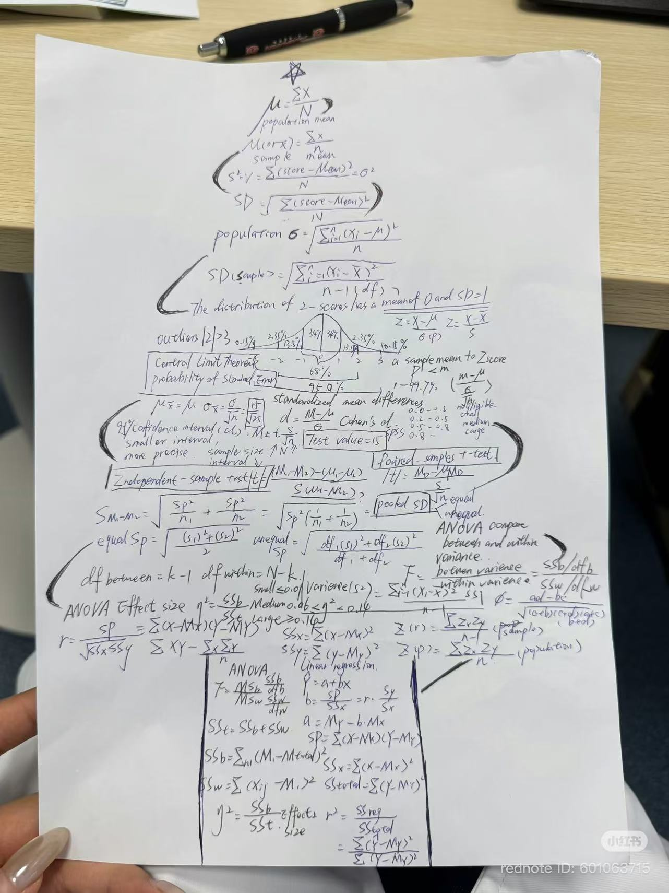

1、下列关系中，属于统计学意义上相关关系的有（  ABC  ）
（A）每日咖啡因摄入量与工作专注度之间的关系。
（B）是否完成平时作业与期末考试是否合格之间的关系
（C）大学生每周运动量与主观幸福感评分之间的关系
（D）被试A在某一项记忆任务中的正确率与错误率之间的关系

*解析：
错误率=1−正确率，本质上是同一个测量变量的互补变形，不是两个独立随机变量之间的关系，因此不属于统计意义上的相关，D错误。


2、在一个调查中，研究者发现收入与生活满意度的皮尔逊（Pearson）相关为r = 0.25。之后研究者仅保留收入在30–50万范围内的人重新计算，相关系数下降为r = 0.04。下列解释合理的有（  B(C)D  ）
（A）第二次分析的 r 几乎为零，说明在该范围内收入与生活满意度没有任何关系
（B）第二次分析得到的相关系数显著低于第一次，可能是由于收入的范围限制（range restriction）导致的
（C）对比两次分析结果，说明收入对生活满意度的影响可能存在边际递减效应
（D）如果未来再次在收入范围很宽的样本中重新收集数据并计算相关，相关系数更可能接近0.25而不是0.04

*解析：
相关接近0 只说明线性相关很弱，不代表完全没关系（可以有非线性关系、或误差太大导致检出不出），A错误。
```{r}
# 非线性相关
x = seq(-5,5)
y = x^2

plot(x,y)
cor(x,y)
```
当样本中某个变量的取值范围被限制在一个较窄的区间内时，相关系数仅表示该小范围内的情况，可能与总体结果不同，B正确。
当移除收入两端数据后相关系数下降，暗示收入和满意度可能存在非线性关系，即收入达到一定水平后对满意度的边际效应减弱，C正确。
全范围样本得到的r = 0.25是对总体相关系数的一个估计，在同样宽范围的独立样本中重新研究，结果很可能与之接近，D正确。


3、某研究者对性别（二分变量：男/女）和数学焦虑分数（连续变量）进行相关分析，下列说法正确的是（ CD ）
（A） 性别与数学焦虑分数之间适合使用φ系数进行相关分析
（B） 性别与数学焦虑分数之间适合使用斯皮尔曼（Spearman）相关分析
（C） 点二列相关（Point-Biserial Correlation）本质上是皮尔逊相关
（D） 如果数学焦虑分数的分布严重偏态，点二列相关的估计值可能出现偏差

*解析：
φ 系数只适用于两者都是二分变量的情形；数学焦虑分数是连续变量，不符合φ的适用条件，A错误。
斯皮尔曼相关适用于两个顺序变量，B错误。
点二列相关本质上就是皮尔逊相关，只不过其中一个变量是连续变量，另一个是二分变量，C正确。
点二列相关是基于皮尔逊的，所以同样对偏态、异常值比较敏感，需要满足正态性假设。在严重偏态时，皮尔逊分析可能无法反映真实的单调关系，D正确。
```{r}
set.seed(2)
n <- 200
x <- rexp(n, rate = 0.25)                 # 右偏长尾
sigma <- 1 + 1.2*x                        # 噪声随x增大
y <- 2*x + rnorm(n, 0, sigma)

plot(x,y)
c(Pearson = cor(x, y),
  Spearman = cor(x, y, method="spearman"))

# 去掉x最大的5%
cut <- quantile(x, 0.95)
keep <- x <= cut
c(Pearson_cut = cor(x[keep], y[keep]))
plot(x[keep], y[keep])

# 对x做log变换后再算Pearson（常见修正）
x_log <- log1p(x)
plot(x_log,y)
c(Pearson_logx = cor(x_log, y))
```


4、研究者测量了一批被试的压力水平与皮质醇浓度，发现Pearson’s r = 0.62。下列结果解读正确的有（  D  ）
(A) 压力值与皮质醇浓度之间存在显著的正相关
(B) 压力高的人通常皮质醇也更高，因此压力会导致皮质醇升高
(C) 若将样本划分为“高压力”与“低压力”两组，再分别计算相关系数，相关系数的数值保持不变
(D) 研究者在分析前应检查散点图，以判断是否存在极端值导致相关系数被高估或低估

*解析：
只根据r不能推断显著性，还需要样本量和检验，A错误。
相关关系不等于因果关系，B错误。
把样本划分为两组，再各自计算组内相关，被解释变量和自变量的协变结构发改变，相关系数可能会发生很大变化，C错误。
数据中的离群值可能会造成相关系数的高估或低估，因此很有必要检查散点图和异常值，确认不是极端点影响了相关，D正确。
```{r}
#极端值导致低估
set.seed(123)
x <- 1:40
y <- x + rnorm(40, 0, 5)

x_out <- c(1, 42)
y_out <- c(50, -30)

x_all <- c(x, x_out)
y_all <- c(y, y_out)
plot(x_all, y_all)

cor(x,y)
cor(x_all, y_all)
```

```{r}
#极端值导致高估
set.seed(123)
x <- rnorm(40)
y <- rnorm(40)

x_out <- c(1.5, 2)
y_out <- c(10, 14)

x_all <- c(x, x_out)
y_all <- c(y, y_out)
plot(x_all, y_all)

cor(x, y)
cor(x_all, y_all)
```


5、研究者考察睡眠时长与认知表现的关系。随机抽取n = 20名被试，得到皮尔逊相关系数r = 0.40。请根据相关显著性检验公式，计算并判断以下选项中说法正确的是（ BD ）
（A）本次检验的自由度为19
（B）本研究中，皮尔逊相关系数的t值约为1.85
（C）在显著性水平 α = 0.05（双尾）时，该相关显著
（D）在本研究中，可以认为睡眠时长解释了认知表现的数据变异性的16%

解析：
自由度df = n − 2 = 18，A错误。
$$t=\frac{r}{\sqrt{\frac{1-r^2}{n-2}}} = \frac{0.4}{\sqrt{\frac{1-0.16}{18}}}\approx1.85$$，B正确
```{r}
qt(0.975, 18)  
```
tcritical(18) > 1.85，p>0.05，相关不显著，C错误。
决定系数r² = 0.40² = 0.16，意味着Y值（认知表现）16%的变异可以由X值（睡眠时长）预测，D正确。


```{r}
x = c(74, 71, 72, 68, 76, 73, 67, 70, 54, 74)
y = c(76, 75, 71, 70, 76, 79, 65, 77, 62, 72)
n = 10
mean_x = mean(x)
mean_y = mean(y)
dev_x = x - mean_x
dev_y = y - mean_y

sum_xy <- sum(dev_x * dev_y)  #两个变量乘积和
sum_x2 <- sum(dev_x^2) 
sum_y2 <- sum(dev_y^2)  #和方

r = sum_xy / sqrt(sum_x2 * sum_y2)  #r
print(r)
r * sqrt(n-2) / sqrt(1-r^2)   #t

cor.test(x, y)
```


# 6、研究者调查了某公司员工的工作行为与心理状态，收集了120名员工的数据，存储于hw10.xlsx中。变量说明如下（假定样本为简单随机抽样，观测值相互独立）：
•	hours：每日平均工作时长（单位：小时，连续变量）
•	stress：压力水平（数值越高表示压力越大，连续变量）
•	remote：是否远程办公（yes/no，二分变量）
请在 R 中完成以下问题（显著性水平为0.05，数值结果除不尽时均保留3 位小数）：

```{r}
rm(list=ls())
library('readxl')
data = read_xlsx('hw10_data.xlsx')
attach(data)
```

#（1）请使用 R 代码绘制员工工作时长（hours）与压力水平（stress）的散点图；根据散点图及必要的统计检验结果，判断并说明这两个变量是否满足皮尔逊相关分析的主要前提假设
```{r}
#散点图
plot(hours, stress,
     xlab = "Working hours",
     ylab = "Stress level")

#正态性检验
library(rstatix)
shapiro_test(hours)
shapiro_test(stress)
```
*前提假设：
1）两个变量之间的关系是线性：根据散点图，数据点大致围绕一条直线分布，没有呈现明显的非线性。
2）两个变量必须是等距或等比变量（连续变量）：由题意，hours和stress均连续。
3）两个变量都服从高斯分布：分别对hours与stress做正态性检验，结果显示两者都满足p >0.05，未拒绝正态性假设。
4）随机独立取样：由题意，观测彼此独立。


#（2）请使用R代码分别计算工作时长（hours）与压力水平（stress）之间的皮尔逊和斯皮尔曼相关系数，并判断是否显著（需要用文字完整地报告所有结果）
```{r}
# pearson correlation
#cor(hours, stress, method = 'pearson')
cor.test(hours, stress)

# spearman correlation
#cor(hours, stress, method = 'spearman')
cor.test(hours, stress, method = 'spearman')
```
*工作时长与压力之间存在显著的正相关（Pearson's r = 0.538, t (118) = 6.928, p < 0.001），说明工作时长越长，压力水平越高
*工作时长与压力之间存在显著的正相关（Spearman's ρ= 0.465, p < 0.001），说明工作时长越长，压力水平越高 

```{r}
library(bruceR)
newdata <- data[,c('hours','stress')] 
Corr(newdata)
Corr(newdata, method = 'spearman')
```

```{r}
# visualize the results
library(PerformanceAnalytics)
chart.Correlation(newdata)
chart.Correlation(newdata,method = 'spearman')
```


#（3）i.	计算是否远程办公（remote）与压力水平（stress）之间的点二列相关系数和显著性，用文字报告结果
```{r}
#如果直接进行cor发现会报错
#cor(remote, stress)

remote_bin <- ifelse(remote == "yes", 1, 0)

#cor(remote_bin, stress)
cor.test(remote_bin, stress)
```
*是否远程办公（yes = 1，no = 0）与员工压力水平之间存在显著相关（r = -0.588, t(118) = -7.906, p < 0.001），说明远程办公员工的压力水平整体上低于非远程员工 

#ii.	使用t检验的方法，比较“远程办公员工”和“非远程办公员工”的平均压力水平是否存在显著差异，用文字报告结果
```{r}
# 方差齐性
library(carData)
library(car) 
leveneTest(stress, remote)

# 独立样本t检验
t.test(stress ~ remote, var.equal = FALSE)  
```
*独立样本 t 检验显示，远程办公员工与非远程员工在压力水平上的差异具有统计学意义，t (117) = 8.463, p < 0.001，说明远程办公组的平均压力显著低于非远程办公组 

# iii. 简要说明点二列相关与独立样本 t 检验之间的联系
*在只有两个变量，且其中一个是二分变量，另一个是连续变量的情况下，点二列相关与独立样本t检验是在分析同一现象，即组间均值差异。当两组数据方差同质时，t检验的效应量r2等于相关系数r的平方。当两组数据方差不同质时，点二列相关系数不再与等方差独立样本t检验严格等价。


#（4）根据是否远程办公（remote）将员工分为两组，分别对两组员工单独计算工作时长（hours）与压力水平（stress）之间的皮尔逊相关系数及其显著性检验结果，文字报告结果；并且，比较两组的结果，报告结论
```{r}
# 远程办公组
cor.test(hours[remote == "yes"], stress[remote == "yes"])

# 非远程组
cor.test(hours[remote == "no"], stress[remote == "no"])
```
*在远程办公员工中，工作时长与压力呈正相关（r = 0.257, t (48) = 1.845, p = 0.070），但未达到统计显著
*在非远程办公员工中，工作时长与压力呈显著正相关（r = 0.614, t (68) = 6.422, p < 0.001）, 说明在非远程办公条件下，工作时长越长，压力越高
*对比两组可以发现，非远程办公组中工作时长与压力的正相关更明显且显著，而远程组相关较弱且不显著


#（5）根据以上分析能否直接推断出变量之间的因果关系？如果不能，请举出一个例子来反驳因果关系
*本研究中的分析均为相关分析或组间均值比较，不能直接推出因果关系。
*反例1：公司中高责任岗位的员工往往既需要承担更多任务（因此工作时长更长），又承受更大的业绩压力（因此压力得分更高）。在这种情形下，是岗位责任这个潜在变量同时导致“工时长”和“压力高”。我们在统计上看到的是工时与压力的正相关，但真正驱动二者共同变化的却可能是“岗位性质”，而不是工时直接导致压力。
*反例2：对于远程办公导致压力更低的因果推论，也存在替代解释。比如，公司允许自我管理能力更强的员工优先远程办公；这些员工具有更好的自我调节能力，本身压力就更低。因此，远程办公与低压力的相关，可能反映的是“自我管理能力”这一第三变量的作用，而不是工作形式本身造成了压力变化。


```{r}
set.seed(2023)
x1 <- rnorm(24,10,2)
x2 <- rnorm(24,5,0.4)
y <- 2*x1+3*x2
example_data <- data.frame(x1 = x1, x2 = x2, y = y)  #创建数据框

#画散点图
plot(x1,y)

# 一元线性模型
model1 <- lm(y~x1, data = example_data)  #拟合的model：y = b*x_1+a

# 多元线性模型不含交互
# model2 <- lm(y~x1+x2, data = example_data)   #拟合的model: y = b_1*x_1+b_2*x_2+a

# 多元线性模型含交互
# model2 <- lm(y~x1+x2+x1:x2,data = example_data)   #拟合的model: y = b_1*x_1+b_2*x_2+b_3*x_1*x_2

summary(model1) #查看结果
```

```{r visualization}
plot(x1,y,main = "Relationship between y and x1", abline(lm(y~x1)),xlab = "x1",ylab = "y")
```

```{r}
(model1$coefficients) #系数，k和b
(model1$residuals)    #残差
```

```{r}
#预测

predict(model1)


#新数据
data <- data.frame(x1 = c(2.5)) # the column name should be the same with the linear model

predict(model1,newdata = data,
        interval = 'confidence')   #显示置信区间
```


```{r}
rm(list=ls())
library('readxl')
data = read_excel('demo_data.xlsx')
attach(data)

# 正态性检验
library(rstatix)
data %>%
  group_by(Group) %>%
  shapiro_test(y)
# 中括号表示条件的限制
shapiro_test(y[Group == "A"])
shapiro_test(y[Group == "B"])
shapiro_test(y[Group == "C"])

data$Group = factor(data$Group, 
                    levels = c("C","B","A"))

#方差齐性
library(carData)
library(car) 
leveneTest(y, Group)

#t检验
#单样本
t.test(y, mu = 0, alternative = c("two.sided", "less", "greater")) 
#配对样本
#t.test(x, y, paired = TRUE)
#独立样本
#t.test(x, y, var.equal = TRUE)
t.test(y~Class, var.equal = FALSE)


#方差分析
library(bruceR)

result = MANOVA(
  data,
  dv = NULL, #单因素
  dvs = "S1:S2", #重复测量
  dvs.pattern = "S(.*)", #定义命名规律
  between = "Group", #分组变量
  within = "Time", #组内变量
  sph.correction= "GG", #违背球形假设的校正
)

EMMEANS(result, effect = "Time", by = "Group", p.adjust = "Scheffe") #固定Group，比较Time

emmip(result, ~ Group, CIs = TRUE, at = list(Group = c("A","B","C")))
```
 ** 报告格式：xx方法，t(df) = xx，p=xx，效应量，是否显著（哪个大哪个小）**

```{r}
summary(result)
# summary可以得到准确的SS
```




# Wish You A Merry Christmas!!


