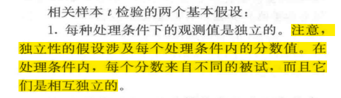
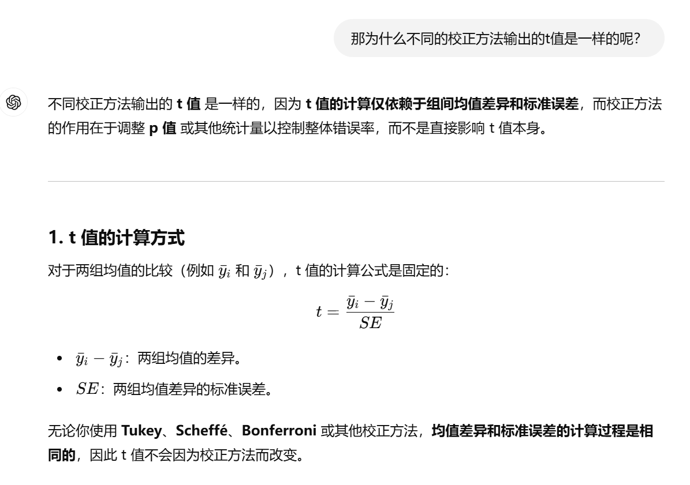
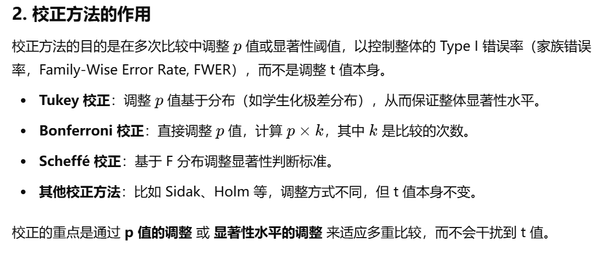

6
反应时（reaction time，rt）指从接受刺激到机体做出反应动作所需要的时间。反应时的长短可以在一定程度上反映注意力的高低，一般来说反应时越短注意力表现越好。
小明想要探究睡眠剥夺程度是否会影响注意力表现，故收集了20名被试，每位被试在1个月内完成了三种条件的实验：睡眠8小时、睡眠4小时和睡眠0小时，并在睡眠结束后收集其反应时数据，保存在hw7_data.xlsx中。其中，id为被试编号，rt为反应时（单位为ms），condition的8、4和0分别表示睡眠8小时、睡眠4小时和睡眠0小时的三种条件。不同被试的反应时数据相互独立。请根据要求，回答下列问题。

#（1）小明应该使用哪种方差分析方法？为什么？（3分）
应该使用单因素重复测量方差分析。（One-way Repeated Measures ANOVA）（2分，需要答到“单因素”“重复测量”“方差分析”）
原因：小明测量了每一名被试的三种反应时，测量了同一批被试在不同处理条件下的因变量的值，应使用重复测量方差分析。（1分）

如果要对数据人为进行分类呢
sheet3里有睡眠时长的数据
把睡眠2小时及以下的定为睡眠0小时
睡眠大于2小时，不超过6小时的定为睡眠4小时
睡眠大于6小时的定为睡眠8小时
```{r}
# 先创建一个新的列，所有的均记作0
# 再把2-6的和6以上的改成4和8
# 开闭区间一定要看清楚
rm(list = ls())
library(readxl)
data = read_xlsx('hw7_data.xlsx',sheet = 3)

```

# （2）此方法需要满足哪些前提假设？请一一列举并全部进行检验。（11分）
前提假设（4个）：
1.每个处理条件下的样本观测值相互独立，即一个观测值不受其他任何观测值的影响。根据题干“不同被试的反应时数据相互独立”，满足该假设。（列举1分，检验1分）

```{r}
rm(list = ls())
library(readxl)
data = read_xlsx('hw7_data.xlsx')
# attach(data) 无需再写data$
# 列名少且不复杂的时候没必要用
data$condition = as.factor(data$condition)
# 别忘了变为factor，不然可能会报错
```


独立性检验是指同一个处理条件下，被试A的数据不会影响被试B的数据
不是说被试A在条件1下的数据不会影响条件2下的数据（不可避免的会有顺序效应）


2.每个处理条件下的样本来自的总体服从正态分布，当样本量较大时此前提就不再那么重要。 
正态性检验
```{r}
library(rstatix)
data %>%
  group_by(condition) %>%
  shapiro_test(rt)

# 中括号表示条件的限制
shapiro_test(data$rt[data$condition == 0])
shapiro_test(data$rt[data$condition == 4])
shapiro_test(data$rt[data$condition == 8])
```
# 需要文字报告！
注意答案的取舍，不必要全部截图
检验得到三种条件下的反应时均符合正态分布，p值分别为0.50、0.61和0.10（列举1分，检验2分）


3.每个处理条件下的样本来自的总体有相同的方差，即方差同质性假设。
# 方差同质性假设（不作采分点，今后不用做）
```{r}
library(car)
leveneTest(data$rt,data$condition)
leveneTest(rt ~ condition, data)
```
leveneTest方差同质性检验显示不同条件下的方差同质，F = 0.63，p = .537，满足方差同质性假设。（列举1分，检验2分）

4.协方差同质性，即球形检验。
# 球形检验
```{r}
# 长数据转为宽数据
matrixdata <- matrix(data$rt, nrow=20, ncol=3)
mlmfit <- lm(matrixdata ~ 1)
mauchly.test(mlmfit,X = ~1)
```
结果显示满足协方差同质性假设，W = 0.94，p = .586，故无需进行Greenhouse-Geisser校正。（列举1分，检验2分）
# 当然我们更建议大家直接使用MANOVA函数进行协方差同质性的检验


前提假设：
独立样本t检验需要做方差同质
单因素独立测量方差分析：独立样本，正态，方差
单因素重复测量方差分析：独立样本，正态，协方差
双因素独立测量方差分析：独立样本，正态，方差


#（3）将显著性水平设为0.05，使用合适的方差分析方法，使用r中的MANOVA函数计算完成本研究。答案中需要包含：虚无假设H0、备择假设H1、方差分析代码及结果（F值、p值、效应量η²）、结论（注：1.除粘贴R语言结果之外，还需进行相应的文字描述，没有文字描述的，酌情扣分；2.无需呈现完整的代码输出结果，只需截图呈现必要结果即可；3.本小问无需进行事后检验）。（6分）

虚无假设H0：三种反应时没有差异/ 睡眠剥夺程度不会影响注意力表现（1分）。
备择假设H1：三种反应时有差异/ 三种反应时中，至少有一种反应时不同于其他两类/ 睡眠剥夺程度会影响注意力表现（1分）。
```{r}
library(bruceR)
ANOVA_repeated <- MANOVA(data, subID = 'id', dv = 'rt' ,within = 'condition')
# 无需print

# 不需要做方差齐性，也不建议做
# 需要报告的：统计量、p值、效应量（就算不说也要知道报告）
# 效应量都是报partial eta^2(本次不扣分)
# 直接看p就行，无需再把F与临界值比较
```
重复测量方差分析结果显示，F(2, 38) = 14.24, p < .001 （η² = 0.43） 故拒绝H0，认为三种反应时中，至少有一种反应时不同于其他两类（代码1分，结果1分，文字叙述2分）。

未使用要求的函数-2
效应量如果题干中未要求可以不报告，但是F、自由度和p需要有


$$ partial-\eta^2 = \frac{SS_{effect}}{SS_{effect} + SS_{error}} \\
generalized-\eta^2 = \frac{SS_{effect}}{SS_{total}}$$
因此一般partial eta^2更大(在存在组内变量的条件下，如果都是组间变量则一样大)
# 报告的小数位数
# 直接用MANOVA做球形检验和方差齐性检验就行，在此不额外介绍球形检验的代码（有些复杂）
# 如果不满足球形检验，需要加上sph.correction = ‘GG’	
# 球形检验只有当自变量的水平数不小于3时才需要做，如果水平是2，该假设始终满足（看代码结果即可）
# 如果不满足方差齐性……那就不满足吧，但题目里是得做下去

# 可以先加上GG校正跑一遍MANONA，然后看结果
# p<0.05则需要校正，否则不用（如果额外校正了也会扣分）


x1是自变量，y是因变量
```{r}
?MANOVA
# 单因素独立测量 MANOVA(data=, dv=, between=, ...)
shortdata = read_xlsx('testdata.xlsx')
```


x1是自变量，y和y2是因变量(宽数据)
```{r}
?MANOVA
# 单因素重复测量 MANOVA(data=, dvs=, dvs.pattern=, within=, ...)

MANOVA(data=shortdata, dvs = 'y:y2',dvs.pattern = '(.*)', within='time') 

# within是自己命名的，但是不能和现有的变量名重合

# dvs的写法
# 'y:y2' c('y','y2')

# dvs.pattern 类似于正则表达式
# . 一个字符
# * 重复前面的字符0-n次
# 只需记住这个'(.*)'，可以匹配任意长度的任何字符
# 不能单独写'(*)'，需要写'(.*)'
# 如果你的列名是y_before和y_after，想让两个水平的名称是before和after：'y_(.*)'
```


x1和x2是自变量，y是因变量
```{r}
?MANOVA
# 双因素独立测量 MANOVA(data=, dv=, between=, ...)
```


长数据，sheet2
没有单因素独立

x1是自变量，y是因变量（长数据）
```{r}
?MANOVA
# 单因素重复测量 MANOVA(data=, subID=, dv=, within=, ...)
longdata = read_xlsx('testdata.xlsx',sheet = 2)
```


```{r}
# 试试把shortdata的y和y2转化为long_data
long = data.frame(id = rep(1:20,2), y = c(shortdata$y,shortdata$y2), condition = c(rep(1,20),rep(2,20)))
```


#（4）根据（3）中的结果填写下面ANOVA table中第1行和第4行的7个空缺数字（非整数数字保留2位小数即可）（7分）
见word
```{r}
summary(ANOVA_repeated)
# summary可以得到准确的SS
```

#（5）使用r中的EMMEANS函数分别进行Tukey’s HSD和Scheffe方法的事后检验，并分别报告结果，得出本研究的研究结论（报告事后检验的结果时，需说明不同组别的大小关系，共14分）。

事后检验
无需再写虚无假设和备择假设，不会作为给分点
```{r}
EMMEANS(ANOVA_repeated, effect = "condition",p.adjust="tukey")  # default is bonferroni correction
EMMEANS(ANOVA_repeated, effect = "condition",p.adjust="scheffe")

emmip(ANOVA_repeated,~ "condition")
# 推荐可以先自己看一下数据的样子


# 只用报告三个显著差异就行，没有必要比较……和……的差异相对较小
# 关于t和效应量的正负
# tukey不是直接和HSD比大小吗，为什么还会有t和p值？
```




见word
反应时越长，注意力表现越差？不太严谨
0小时和4小时表现相同？

```{r}
# 昨天讲到的bonferroni
EMMEANS(ANOVA_repeated, effect = "condition")
```

#（6）在（3）的基础上，使用r语言，但不能使用现成的方差分析函数，手动计算进行Tukey’s HSD方法的事后检验，说明不同组别的大小关系，报告简要结果。（5分）
```{r}
(q_critical <- qtukey(0.95, 3, 38)) # 代码1分
# 或者查表 书上352页，df在30-40，k=3，q在3.44-3.49之间。应该取3.44（更加严格）
(HSD <- q_critical * sqrt(3636.798/20)) # 代码1分，结果1分
# 这里是MSE，不是MS within
# 别忘了好好整理到cheating sheet上
```
记得写计算q的过程而不是只有HSD
应该是一个比较重要且易错的点

```{r}
# 代码3分，结果3分
mean0 = mean(data$rt[data$condition == 0])
mean4 = mean(data$rt[data$condition == 4])
mean8 = mean(data$rt[data$condition == 8])

mean0
mean4
mean8

abs(mean8 - mean4)
abs(mean8 - mean0)
abs(mean4 - mean0)
```

#（7）小王在对本数据进行分析时，使用了单因素独立测量方差分析进行处理，并得到了下面的ANOVA table，请你使用r中的MANOVA函数进行独立测量方差分析的处理（无需检验前提假设，无需文字汇报结果），帮他填写下表中的9个空缺数字（非整数数字保留2位小数即可）。（10分）
```{r}
ANOVA_independent <- MANOVA(data, dv = 'rt' ,between = 'condition')
summary(ANOVA_independent)
# 还是找不到SS，可以去右边的Data栏
```
见word


#（8）对比（4）和（7）的两个ANOVA table，两种方差分析方法的SSbetween treatments和SSerror的大小有何区别？怎么理解重复测量方差分析相比独立测量方差分析有更强的效力？（4分）
独立测量方差分析：SSbetween treatments = 103546.66，SSerror = 165688.17
重复测量方差分析：SSbetween treatments = 103546.66，SSerror = 138198.40
二者的SSbetween treatments大小相同（1分），重复测量方差分析的SSerror更小（1分），
在重复测量方差分析中个体差异被移除，因此SSerror更小，这也导致当存在处理效应时，处理效应更容易被检出，因此效力更高（2分）

SS小不代表MS小，也不能代表F大
$$ 效力power 不等于 效应量\eta^{2}$$
重复测量的效力更大也并非必然

为什么“通常”效力更大？
  同一个人在不同条件下的数据必须具有显著正相关。
  这在大多数心理学实验中成立，因为同一个人的能力、反应特点、判断方式是稳定的：
  他分数高，在所有条件下都比较高
但若相关性非常低：
  剔除个体差异的“好处”变弱
  重复测量不一定更有力，甚至比独立设计还差


5 
主效应显著，事后检验一定显著吗
```{r}
library(readxl)
data = read_xlsx('hw7_data.xlsx',sheet = 2)
data$condition = as.factor(data$condition)
library(bruceR)
ANOVA_repeated <- MANOVA(data, subID = 'id', dv = 'rt' ,within = 'condition')
EMMEANS(ANOVA_repeated, effect = "condition",p.adjust="tukey")
```


格式问题
采用什么统计方法（单/双因素 独立/重复测量 方差分析)(单尾/双尾 t检验)
（有哪些变量，是组内变量还是组间变量，有几个水平）
显著性水平设为0.05

前提假设：
1. 观测独立：每个样本的观测值互相独立
2. 正态性假设：样本所在的总体符合正态分布（样本量很大时可以不用满足）
3. 方差同质性假设（在有组间变量时）：样本所在总体的方差相同
4. 球形假设（在有组内变量时）：协方差同质性。违背了之后做GG校正

1 直接由题意得到
2 用shapiro_test(rstatix包里) 对每一个条件下的样本进行检验，p不小于0.05即可
3 用MANOVA或者leveneTest(car包里)
4 用mauchly.test或MANOVA

进行检验

汇报结果（单因素分析）：
A的主效应显著，F(1, 14) = 7.2，p = .010，ηp2 = .467，
  如果只有两个水平：直接得出结论，说明A对y有显著影响，……显著高于……
  如果有3+个水平：说明A对y有显著影响，需要进行事后检验
A的主效应不显著，F(1, 14) = 7.2，p = .100，ηp2 = .467，
  直接得出结论：说明A对y没有显著影响
  
事后检验：
采用Scheffe/Tukey/Bonferroni方法对其进行事后检验，结果显示，
  a水平的y显著高于b水平，t(14) = 2.54，p < .001，Cohen’s d = 0.428
  a水平和b水平的y没有显著差异，t(14) = 2.54，p = .100，Cohen’s d = 0.428
EMMEANS(MANOVA1,effect = "factorA")


对于双因素方差分析
交互作用：
A和B的交互作用显著，F(2, 14) = 7.2，p = .010，ηp2 = .467，需要进行简单主效应检验
A和B的交互作用不显著，F(2, 14) = 7.2，p = .100，ηp2 = .467，不需要进行简单主效应检验

简单主效应检验
## 非常重要的一点
双因素方差分析做简单主效应的时候需要先检验
看EMMEANS的代码的第一个表格即可

# 如果只有两个水平，无需进行事后检验，直接报结论就行

# 复习一下：F = t^2
```{r}
qt(0.95,38)
qf(0.90,1,38)
qt(0.95,38)^2
```