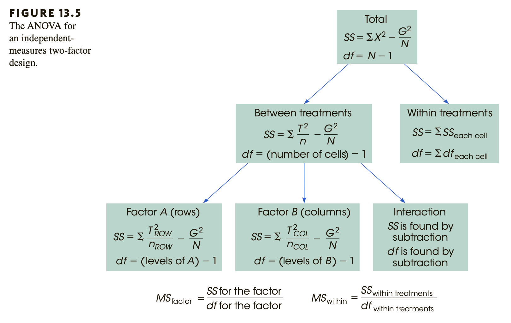
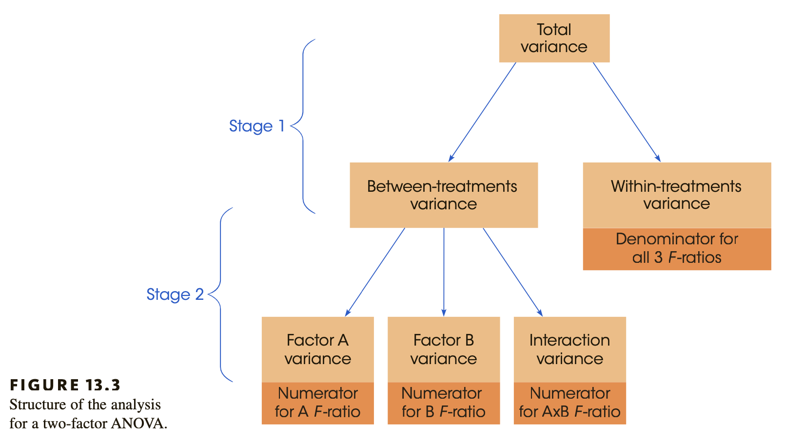
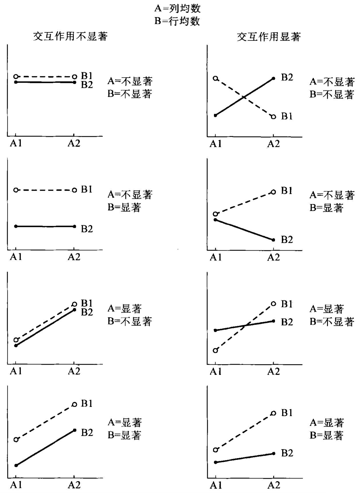

本讲义内容由之前的助教张旭阳、李佳霖的讲义改编而来。

```{r}
library(bruceR)
library(tidyverse) # 数据长宽转换
library(rstatix)
library(car)
```

## 长数据与宽数据的转换

```{r}
# 生成一组数据，共有6名被试，每名被试进行了4次测量
data1 <- data.frame(
  participant = rep(c('A','B','C','D','E','F'),4),
  group = c(rep('RO',6),rep('RAR',6),rep('APQ',6),rep('CAA',6)),
  quiz = c(3,3,4,6,6,8,5,3,5,7,8,8,8,5,8,9,8,10,8,9,7,10,10,10)
)
```

```{r}
#长数据转化为宽数据
require(data.table)
data2 <- dcast(data1,participant~group)
```

```{r}
#宽数据转化为长数据
data3<- melt(data2,id = 'participant',variable.name = 'group', value.name = 'score')
```

## 两因素独立测量方差分析

{width="550"}

{width="550"}

{width="450"}

### 例子

研究者想探究不同学习方式(Computer/Paper/iPad)和学习策略(Self-regulated/Fixed)对学业表现(Performance)的影响。

```{r}
# 本研究的数据
data <- data.frame(
  Presentation = rep(rep(c('Paper','Computer','iPad'),2),each=5),
  Time = rep(c('Self','Fixed'),each = 15),
  Performance = c(11,8,9,10,7,4,4,8,5,4,10,7,10,6,7,10,6,10,10,9,10,7,10,6,7,10,6,10,10,9))
```

```{r}
# 图形表示

data %>%
  group_by(Presentation, Time) %>%
  summarise(M = mean(Performance), se = sd(Performance)/sqrt(length(Performance)), .groups = 'keep') %>%
  ggplot(aes(Presentation, M, fill = Time)) + 
  geom_bar(stat = 'identity', position = 'dodge',width = 0.8) + 
  geom_errorbar(aes(ymin = M-se, ymax = M+se),position = 'dodge',width = 0.8) + 
  ggtitle('Barplot for Interaction I')

data %>%
  group_by(Presentation, Time) %>%
  summarise(M = mean(Performance), se = sd(Performance)/sqrt(length(Performance)),.groups = 'keep') %>%
  ggplot(aes(Presentation, M,color = Time)) + 
  geom_point(size = 3) + 
  geom_line(aes(group = Time),linewidth = 1.5) + 
  geom_errorbar(aes(ymin = M-se, ymax = M+se),width = 0.3) + 
  ggtitle('Line graph for Interaction I')

data %>%
  group_by(Presentation, Time) %>%
  summarise(M = mean(Performance), se = sd(Performance)/sqrt(length(Performance)),.groups = 'keep') %>%
  ggplot(aes(Time, M, fill = Presentation)) + 
  geom_bar(stat = 'identity', position = 'dodge',width = 0.8) + 
  geom_errorbar(aes(ymin = M-se, ymax = M+se),position = 'dodge',width = 0.8) + 
  ggtitle('Barplot for Interaction II')

data %>%
  group_by(Presentation, Time) %>%
  summarise(M = mean(Performance), se = sd(Performance)/sqrt(length(Performance)),.groups = 'keep') %>%
  ggplot(aes(Time, M,color = Presentation)) + 
  geom_point(size = 3) + 
  geom_line(aes(group = Presentation),linewidth= 1.5) + 
  geom_errorbar(aes(ymin = M-se, ymax = M+se),width = 0.3) + 
  ggtitle('Line graph for Interaction I')
```

## 使用R代码完成two way ANOVA

### 第一步：双因素方差分析前提假设

### 1. 正态性检验

因变量在每个组内应服从正态分布

### 2. 方差同质性检验

-   **方差同质性检验(Homogeneity of Variance Test)**和**球形度检验(Sphericity Test)**有什么区别？

**方差同质性检验(Homogeneity of Variance Test)**比较的是各处理组间的方差同质性，用于独立样本方差分析

**球形度检验(Sphericity Test)**比较的是各处理组内的协方差同质性，用于重复测量方差分析

### 3. 观测值应该相互独立

```{r}
## 正态性假设(分组检验)
data %>%
  group_by(Presentation,Time) %>%
  shapiro_test(Performance)
```

```{r}
## 方差同质性假设（整体检验）
leveneTest(Performance ~ Time * Presentation, data = data ,center = 'mean') #这个和MANOVA一致
leveneTest(Performance ~ Time * Presentation, data = data,center = 'median')#默认
```

### 第二步：构建模型

重点观察以下几个结果：

1.  主效应是否显著？
2.  交互作用是否显著？


```{r}
## 使用bruceR的MANOVA函数构建模型
# MANOVA的输出结果包含了描述性统计、方差分析表格、效应量、方差齐性检验
# 非常推荐直接使用MANOVA进行方差分析
model2 <- MANOVA(data = data,
       dv = 'Performance',
       between = c('Presentation','Time')) 
```

### 第三步：解读结果决定后续检验

-   **区分主效应，简单主效应和交互效应**

1.  主效应(Main effect)：不考虑其他因素存在时，所关注因素不同水平观察结果的差异。

2.  简单主效应(Simple main effect): 指其他因素水平固定时，所关注因素不同水平的效应之差。

3.  交互效应: 一个因素的效应随着另外一个(或多个)因素水平的变化而变化。

-   **某一变量的处理效应可能会因交互作用的存在而被掩盖：这提示我们交互作用显著时应该做简单主效应**

{width="383"}

-   **如何决定做后续检验**

1.  若主效应显著，可以对单个变量进行事后检验。即不考虑另一个变量，仅考虑当前变量的不同水平之间两两是否有差异；
2.  若交互作用显著，则需要做简单主效应分析（可理解为退化为单因素ANOVA)
    -   **固定**变量A的某一水平，观察变量B不同水平之间的差异（B的简单主效应）
3.  若简单主效应显著，则继续做在A的特定水平下，对B做事后检验(Tukey HSD, Bonferroni, Scheffe)


```{r}
# 不考虑Presentation，对Time进行组间比较
# 没有必要进行，因为Time只有两个组，只有level>2的变量才需要进行事后检验
EMMEANS(model2,effect = 'Time') 
```

```{r}
# 不考虑Time，对Presentation进行组间比较
EMMEANS(model2,effect = 'Presentation',p.adjust = 'scheffe') 

# 可以改变p.adjust参数，来实现不同的事后比较的p值矫正方法
# p.adjust = 'bonf' (默认)
# p.adjust = 'tukey'
```

```{r}
#固定Presentation，比较Time
EMMEANS(model2,effect = "Time", by = "Presentation") 

# 每个Presentation水平下，Time只有两组，不需要进行p值矫正
```

```{r}
#固定Time，比较Presentation
EMMEANS(model2,effect = "Presentation", by = "Time")  

# 注意：一定要根据显著性结果来决定做哪些检验，没必要一股脑全做了
```
