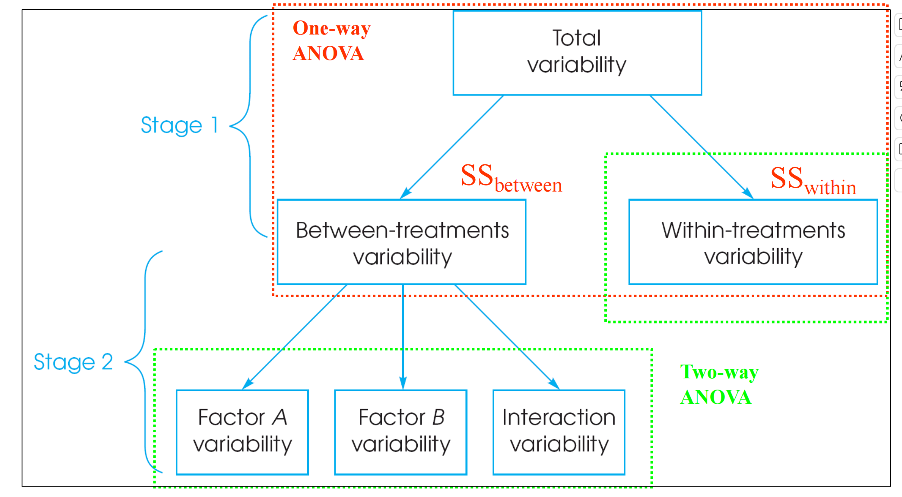
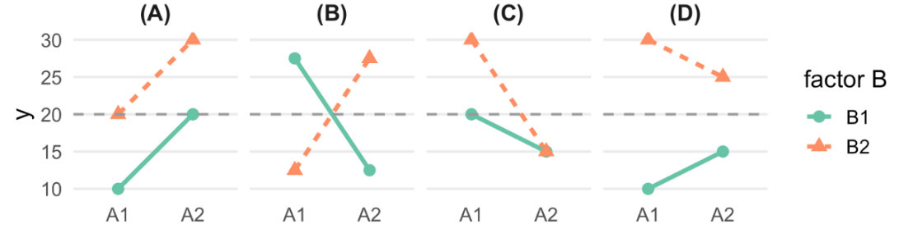
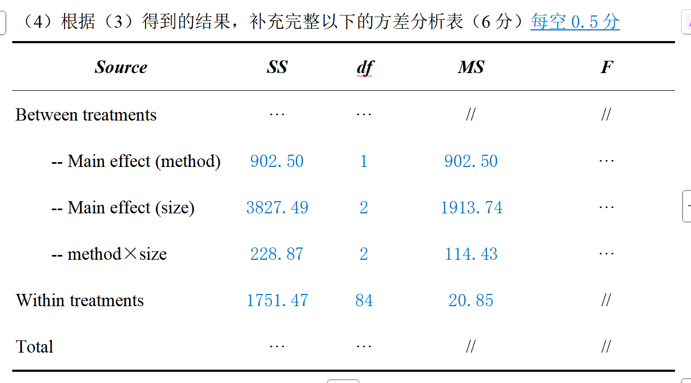

1、在一个 4（年龄组：儿童/青年/中年/老年）× 2（是否运动：运动/不运动）的双因素独立测量方差分析中，
下列关于简单主效应和两两比较的说法中，下列说法正确的有（ C ）
（A）该分析中，交互作用有2个，主效应有8个
（B）如果交互作用显著，则必须对年龄组进行事后检验
（C）如果对年龄组的主效应进行两两事后检验，最多需要进行6次t检验
（D）交互作用显著时需要检验简单主效应，即不考虑其中一个因素，只检验另一因素在不同水平上的两两之间的差异

解析：
年龄组和是否运动分别包括4个和2个水平。存在1个交互作用，即年龄和运动之间的交互作用，存在2个主效应，即年龄的主效应和运动的主效应，A错误；
还需要考虑简单主效应，如果年龄组的简单主效应显著，那么我们需要对不同年龄组的均值做两两比较；如果年龄组的主效应显著，需比较不同年龄组内的总体平均差异，这与交互作用是否显著无直接关系，B错误；
事后检验的次数最多是C42 = 6，但根据具体的研究问题，可以只对特定的组别进行检验（即可以少于6个），C正确；
简单主效应是指控制一个因素在特定的水平上，然后比较另一个因素在不同水平下的均值差异，题目中描述的“不考虑其中一个因素，只检验另一因素在不同水平上的两两之间的差异”是主效应的事后检验，D错误；

有多少个变量就有多少个主效应
$$ 交互作用个数公式：C_n^2 +  C_n^3 + … + C_n^n = 2^n -n -1$$
2 × 3 × 3 设计，是3个主效应，4个交互作用（存在二阶交互、三阶交互AB,AC,BC,ABC）
主效应反映的是单个因素的各个水平之间的均值差异（直接不考虑另一个因素，将其的不同水平加起来）



主效应的事后检验：不考虑一个因素A，只检验另一因素B在不同水平的两两之间的差异
EMMEANS（effect = ）

简单主效应：控制（固定）一个因素factor在特定的水平level，然后比较另一个因素在不同水平下的均值差异。
    EMMEANS（effect = ，by = ），by代表固定谁。
    比较的次数：控制的那个factor有n个level，就比较n次。
    effect有m个level，就需要又比较$C_m^2$次
    所以理论上说是$n * C_m^2$次，但也要根据是否显著

只要主效应显著，就需要进行事后检验   wrong,水平数>2
只要交互作用显著，就需要检验简单主效应   true


2、下列关于双因素独立测量方差分析（two-way ANOVA）前提假设的描述中，正确的是（ ABC ）
（A）独立性假设通常由研究者在进行实验设计时保证，而不是由统计检验完成
（B）每个因素组合条件下的数据都应来自正态分布的总体
（C）如果Levene 检验结果显示p>0.05，那么从方差齐性的角度看可以对数据进行two-way ANOVA
（D）当Shapiro–Wilk检验结果显示p<0.05，即使数据样本量较大，two-way ANOVA 的结果也会受到严重影响
解析：独立性假设主要依赖实验设计（例如随机分配），A正确；B正确；
Levene检验p>0.05，即无法拒绝方差齐性假设，可以在满足其他前提假设的情况下进行two-way ANOVA，C正确；当样本量较大且每个因素条件下的样本量基本相等时，是否满足正态性往往不会ANOVA的结果造成严重影响，D错误。


3、关于一个 3（因素A：低/中/高压力）× 2（因素B：睡眠充足/不足）的双因素独立测量方差分析，下列说法正确的是（ CD ）
（A）主效应反映的是两个因素之间的均值差异，若两个因素之间的均值存在显著差异，则主效应显著
（B）无论因素A的主效应是否显著，都需要对因素A进行事后检验
（C）无论因素B的主效应是否显著，都不需要对因素B进行事后检验
（D）在计算因素A的主效应和A与B的交互作用时，所使用的F统计量临界值相等
解析：主效应反映的是单个因素的各个水平之间的均值差异，A错误；事后检验只应在主效应显著时进行，所以只有在因素A的主效应显著时才需要对因素A进行事后检验，B错误；
因素B只有2个水平，因此无论主效应是否显著都不需要进行事后检验，C正确；

dfA = A的水平数-1 = 3-1 = 2；
dfB = B的水平数-1 = 2-1 = 1；
dfA×B = dfA × dfB = 2 × 1 = 2，
检验A的主效应使用的临界值是F0.95(dfA, dfwithin treatments)，
检验交互作用使用的临界值是F0.95(dfA×B, dfwithin treatments)，
二者大小相同，D正确。


4、下列双因素独立测量方差分析的检验步骤中，一定会用到F统计量的是（ ABD ）
（A）某个变量的主效应检验
（B）某两个变量的交互作用检验
（C）对某个变量的主效应的事后检验
（D）固定一个变量时对另一个变量的简单主效应检验
解析：A、B、D均会用到F统计量；事后检验中Tukey HSD方法只会用到q统计量，Scheffe方法会用到F统计量；Bonferroni方法用到的是t统计量，C错误。

5、下面是一个2（因素A：A1/A2）× 2（因素B：B1/B2）的双因素独立测量方差分析的示意图，如果假设每个实验条件下的人数相等，那么下列结果中A主效应可能显著的有（ AC ）
解析： A图中，A、B主效应均显著，但无交互（两条线平行）；B图中， A、B主效应均不显著，但有交互；C图中，A、B主效应均显著，且有交互；D图中，A主效应不显著，B主效应显著，有交互。


只是一个示意图，不是说图中的就一定显著


6、某高校想要考察“授课方式”和“班级规模”是否会影响大学生的期末考试成绩，数据保存在hw8_data.xlsx中。其中，method为授课方式（0代表传统授课，1代表互动教学），size为班级规模，score为学生的期末考试成绩；每一行分别代表不同被试的数据，每个学生始终在同一个班级中接受同一种模式的教学；考试成绩均为独立测量。请根据要求，回答下列问题（非整数数字均保留2位小数）。

（1）直接写出应该使用的统计方法，以及每个因素（变量）的水平数 （4分）


统计方法：双因素独立测量方差分析

# 为什么要用这个方法？
  有两个变量：双因素
  两个变量都是组间变量。每个被试只会出现在其中的某一个水平：独立测量方差分析

授课方式是组间变量，有2个水平，分别为传统授课和互动教学 （1分）
班级规模是组间变量，有3个水平，分别为小班、中班和大班（small/medium/large）（1分）


（2）完整地写出虚无假设H0的内容 （3分）
授课方式的主效应：不同授课方式不会对学生期末考试成绩造成影响 （1分）
班级规模的主效应：不同班级规模不会对学生期末考试成绩造成影响 （1分）
交互效应：授课方式和班级规模对学生期末考试成绩的影响不存在交互作用（不同授课方式不会对班级规模对学生期末考试的影响带来差异，或不同班级规模不会对授课方式对学生期末考试的影响带来差异）（1分）


（3）将显著性水平设为0.05，请使用（1）中所述的方差分析方法，使用R语言中的函数完成：正态性检验、方差同质性检验、方差分析。答案中需包括：必要的代码和输出结果、文字报告统计量和结论（注：本小问无需进行事后检验和简单主效应检验）（20分）

# 不能做球形检验：没有组内变量

正态性假设
正态性检验shapiro test显示所有组别居民的智商均满足正态分布，ps > .05，满足正态性假设（3分）
# ps表示复数hhh，当然不加这个s也无所谓
# 如果说由于样本量较大不需要进行正态性检验也可以，但似乎这个样本量多大才算大没有界定？
# 还是建议做一下检验
# 需要有一个p，就算你写ps > .05，也比不写好

```{r}
rm(list=ls())
library('readxl')
data = read_xlsx('hw8_data.xlsx')
attach(data)

data$method <- factor(data$method)
data$size <- factor(data$size)
```

```{r}
#正态性检验
library(rstatix)
data %>%
  group_by(method,size) %>%
  shapiro_test(score)

#方差同质性检验&方差分析
library(bruceR)
results <- MANOVA(data, dv = "score", between = c("method", "size"))
summary(results)
```

方差同质性假设
Levene方差同质性检验显示不同组别居民的方差同质，
p = .943，满足方差同质性假设。（结论1分，p值1分）
```{r}
library(car)
leveneTest(score ~ method * size, data, center = mean)
# 双因素中间用*连接（因为存在交互作用）
# 但其实更建议直接用MANOVA检验，只需要自己会做shapiro_test就可以
```


```{r}
library(bruceR)
# 以后大家就都用MANOVA就行，不要再出现aov等函数了，也方便我们批改
results <- MANOVA(data, dv = "score", between = c("method", "size"))
# emmip(results,"method"~"size")
# 推荐可以先自己看一下数据的样子
```

   授课方式的主效应显著，F (1, 84) = 43.28，p < .001，ηp2 = 0.34，
   互动教学模式下学生的期末考试成绩显著高于传统授课模式下的学生（显著结论1分，统计量3分，比较结论1分）
# 这句结论非常重要！

  班级规模的主效应显著，F (2, 84) = 91.78，p < .001，ηp2 = 0.69，
  即班级规模对考试成绩有显著影响，需要进行事后检验（结论1分，统计量3分）
  
  授课方式和班级规模的交互作用显著，F(2, 84) = 5.49，p = 0.006, ηp2 = 0.12，
  需要进行简单主效应检验（结论1分，统计量3分）

关于效应量的汇报，以后我们会在题目里给出到底需不需要报
报告F p 效应量
报告F p
报告p
无需报告统计量


不用填多了

独立测量不强制要求每一组的人数不同


（5）根据上述结果，是否需要对method和size进行事后检验？若需要，请采用R中的EMMEANS函数进行Tukey’s HSD的检验，并完整报告结果和结论；若不需要，请说明理由（15分）

看了回放，可能你会觉得交互作用显著，就不做主效应了

授课方式的主效应显著，但只有两个水平，因此不需要进行事后检验 （结论1分，原因1分）
班级规模的主效应显著，并且有三个水平，因此需要进行事后检验 （结论1分，原因1分）

```{r}
#主效应事后检验
EMMEANS(results, effect = "size", p.adjust = "tukey")
```

采用Tukey’s HSD方法对班级规模进行事后检验，结果显示：
中班学生的考试成绩显著高于大班，t (84) = 7.13，p < .001，Cohen’s d = 1.84；
小班学生的考试成绩显著高于大班，t (84) = 13.54，p < .001，Cohen’s d = 3.50；
小班学生的考试成绩显著高于中班，t (84) = 6.42，p < .001，Cohen’s d = 1.66；
（结论3分，统计量6分）


（6）请说明Bonferroni校正的实现步骤。如果本研究中的变量需要进行简单主效应检验和事后比较，请采用R中的EMMEANS函数进行Bonferroni检验，并报告所有结果；若不需要，请说明理由（本小问无需报告具体统计量，只需报告显著性及其方向）（10分）

Bonferroni校正：1）计算t分数时，不再采用两个小样本的方差，而是使用 ANOVA 的误差项MSE作为共同方差估计；2）显著性检验时使用的临界值不同，如果需要配对比较的数目是k，那么采用的α‘=0.05/k （4分）


授课方式和班级规模的交互作用显著，因此需要进行简单主效应检验。

```{r}
#简单主效应&事后比较
EMMEANS(results, effect = "method",by = 'size')
EMMEANS(results, effect = "size",by = 'method')
```

# r已经自动校正，和0.05比就好

控制班级规模在固定水平，对授课方式进行简单主效应检验，结果发现：
对于大班学生，授课方式的影响不显著；
对于中班和小班学生，互动教学模式下学生的考试成绩显著高于传统教学（2分）
# F = t^2


控制授课方式在固定水平，对班级规模进行简单主效应检验，发现：
传统授课和互动教学模式下，班级规模的简单主效应均显著。
班级规模有三个水平，因此需要进行事后检验 （1分）

事后检验的结果显示，在传统授课和互动教学模式下，
小班学生的考试成绩均显著高于中班和大班
中班学生的考试成绩均显著高于大班 （1分）


(7)
```{r}
emmip(results, method ~ size, CIs = T) 
# 加上了置信区间
```