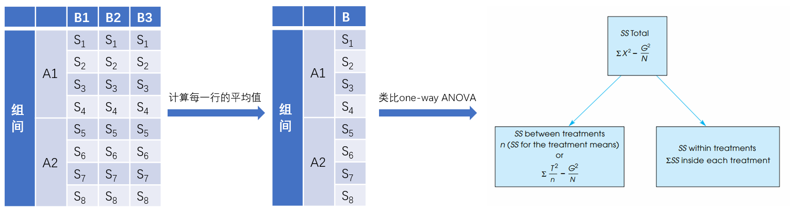

---
output:
  html_document: default
  pdf_document: default
---
本文档代码主要来自于张旭阳，在此表示感谢。

```{r setup, include=FALSE}
knitr::opts_chunk$set(echo = TRUE)
```


-   关于效应量：ges和pes的区别

    -   ges是generalized effect size，pes是partial effect size，二者的计算方式不同
    -   对于单样本独立测量ANOVA，两种eta值是一样的，报告哪个都无所谓；对于单样本重复测量ANOVA，按照课上讲的计算方式，我们应该报告pes而非ges。如果拿不准应该报告哪个效应量，建议都报告
    -   **建议使用bruceR**，计算方法见hw7答案

$ges=\eta^2_G=\frac{SS_{effect}}{SS_{total}}$，$pes=\eta^2_p=\frac{SS_{effect}}{SS_{effect}+SS_{error}}$

## 1. 两因素混合设计方差分析（原理）

$$Y_{ijk}=\mu+\alpha_j+\beta_k+\pi_{i(j)}+(\alpha \beta)_{jk}+(\pi \beta)_{ki(j)}+\epsilon_{ijk}$$

-   字母的含义：

    -   $i$ 代表不同被试subject，$j$代表因素A（组间）的不同水平，$k$代表因素B（组内）的不同水平。
    -   $\mu$代表总体均值
    -   $\alpha_j$代表因素A的不同水平带来的影响，对应$SS_A$
    -   $\beta_k$代表因素B的不同水平带来的影响，对应$SS_B$
    -   $\pi_{i(j)}$代表A的不同水平下，被试之间的个体差异，$i$后面加了$j$，是因为一个被试只能属于$A_1,A_2,...,A_n$中的一个，属于随机误差项，对应$SS_{S/A}$。这里S指的是被试，A指的是因素A，S/A表示每个被试嵌套在条件A下。
    -   $(\alpha \beta)_{jk}$代表因素A和因素B的交互作用，对应$SS_{A \times B}$
    -   $(\pi \beta)_{ki(j)}+\epsilon_{ijk}$代表被试与因素B的交互作用和随机误差之和，对应$SS_{B\times S/A}$
        -   被试与因素B的交互作用：B的不同水平对不同被试的影响不同。例如，被试1在B1条件下的表现优于B2优于B3，而被试2在B1条件下的表现劣于B2劣于B3。
        -   但是，被试与因素B的交互作用$(\pi \beta)_{ki(j)}$和随机误差$\epsilon_{ijk}$区分不开。因为每个被试在B的每个水平下只有一个观测，无法计算出被试和B的交互作用的大小。

-   为什么计算F值时，使用了不同的MSE？

    -   可以粗略地理解为，计算$F_A$时，需要考虑【A的效应】VS【只与A有关的误差】之间的大小关系；计算$F_B$和$F_{A \times B}$时，需要考虑【B（或者A×B）的效应】VS【与B有关的误差】之间的大小关系。
    -   计算$F_A$时，分母是$MS_{S/A}$
        -   **每个被试**都在B的不同水平下完成了测验，B的影响可以在被试内平均掉，计算误差项时，只需要考虑【被试的实际表现】与【A1、A2均值】的差异。误差项是$SS_{S/A}$，即A的不同水平下，被试之间的个体差异之和。
        -   $SS_A=\sum n_j (\bar{Y_{.j.}}-\bar{Y_{...}})^2,df_A=a-1$
        -   $SS_{S/A}=k \sum (\bar{Y_{i..}}-\bar{Y_{.j.}})^2,df_{S/A}=a(s-1)$
    -   计算$F_B$和$F_{A \times B}$时，分母是$MS_{B*S/A}$
        -   每名被试只接受A的一个水平的处理，无法平均掉A的影响，计算误差项时，需要考虑【被试的实际表现】与【A和B不同组合的均值】的差异。误差项是$SS_{B \times S/A}$，即AB的不同组合下，被试之间的个体差异之和（即$\sum (\bar{Y_{ijk}}-\bar{Y_{.jk}})^2$），减去A的不同水平下被试之间的差异之和（即$SS_{S/A}=k \sum (\bar{Y_{i..}}-\bar{Y_{.j.}})^2$）。
        -   $SS_B=\sum n_k (\bar{Y_{..k}}-\bar{Y_{...}})^2,df_B=b-1$
        -   $SS_{A \times B}=\sum n_{jk} (\bar{Y_{.jk}}-\bar{Y_{...}})^2 - SS_A - SS_B,df_{A \times B}=(a-1)(b-1)$
        -   $SS_{B\times S/A}=\sum (\bar{Y_{ijk}}-\bar{Y_{.jk}})^2- k \sum (\bar{Y_{i..}}-\bar{Y_{.j.}})^2,df_{B\times S/A}=ab(s-1)-df_{S/A}=ab(s-1)-a(s-1)=a(b-1)(s-1)$

## 2. 两因素混合设计方差分析（代码）

-   (a)数据结构和描述性统计
-   (b)MANOVA + EMMEANS + emmip
-   (c)工整地报告结果

### (a)数据结构和描述性统计

```{r mixdesign data}
# 本研究的数据
library(tidyverse)
mix_data <- data.frame(
  subID = 1:15,
  Type = rep(c('Fiction','Mystery','Romance'),each=5),
  Month1 = c(1,1,3,5,2,3,4,5,4,4,4,2,3,6,3),
  Month2 = c(3,4,3,5,4,1,4,3,2,5,2,6,3,2,3),
  Month3 = c(6,8,6,7,5,0,2,2,0,3,0,1,3,1,2))

mix_data %>% 
  select(Type, Month1, Month2,Month3) %>% 
  group_by(Type) %>% 
  summarise_all(mean)
```

```{r mixdesign figure*}
library(reshape2)
mix_long <- melt(mix_data, id=c('subID','Type'), # id是保持不变的列
                 variable.name = 'Month', # variable.name是自变量的名字
                 value.name = 'num') # value.name是因变量的名字

mix_long %>% 
  group_by(Type,Month) %>% 
  summarise(M = mean(num), se = sd(num)/sqrt(length(num)))
```

```{r}
mix_long %>% 
  group_by(Type,Month) %>% 
  summarise(M = mean(num), se = sd(num)/sqrt(length(num))) %>% 
  ggplot(aes(Month, M, fill = Type)) +
  geom_bar(stat = 'identity', position = 'dodge')
```

### (b)MANOVA+EMMEANS+emmip

(1)前提检验：观测独立性，正态性Shapiro Test，方差同质性LeveneTest和协方差同质性Mauchly W\
(2)MANOVA函数：data, dv, between三个参数\
(3)主效应+事后检验\
(4)交互作用+简单主效应+事后检验\
(5)EMMEANS函数：model, effect, by三个参数\

```{r calculate SS}
# 手算SS，对照着图来看
SS <- function(x){return(var(x)*(length(x)-1))}

mix_long %>% 
  group_by(Type) %>% mutate(Typemean = mean(num)) %>%
  group_by(Month) %>% mutate(Monthmean = mean(num)) %>% 
  group_by(Month, Type) %>% mutate(Intermean = mean(num)) %>% 
  group_by(Type, subID) %>% mutate(Submean1 = mean(num), Typeerror = Submean1-Typemean) %>%
  group_by(Type, Month, subID) %>% mutate(Submean2 = mean(num), error = Submean2-Intermean) %>%
  ungroup() %>% 
  summarise(SS_Type = SS(Typemean), SS_Typeerror = SS(Typeerror), 
            SS_Month = SS(Monthmean), SS_TM = SS(Intermean)-SS_Type-SS_Month,
            SS_error = SS(error)-SS_Typeerror)
```

#### 正态性

每个格子的数据都要服从正态分布。例如，有组间条件A（A1、A2、A3）和组内条件B（B1、B2、B3），那么九个格子的数据都要服从正态分布。

```{r normality}
library(rstatix)
# check normality [宽数据]
mix_data %>%
  group_by(Type) %>%
  shapiro_test(Month1)
mix_data %>%
  group_by(Type) %>%
  shapiro_test(Month2)
mix_data %>%
  group_by(Type) %>%
  shapiro_test(Month3)

# check normality [长数据]
mix_long %>%
  group_by(Type, Month) %>%
  shapiro_test(num)
```

#### 方差同质性

比较的是各处理组间的方差同质性。例如，有组间条件A（A1、A2、A3）和组内条件B（B1、B2、B3），那么：

-   对于组内条件B1而言，B1A1、B1A2、B1A3的方差同质

-   对于组内条件B2而言，B2A1、B2A2、B2A3的方差同质

-   对于组内条件B3而言，B3A1、B3A2、B3A3的方差同质

#### 球形性

比较的是各处理组内的协方差同质性

```{r MANOVA}
library(bruceR)
# mixed Anova, Levene’s Test, Mauchly’s Test
m = mix_data %>% MANOVA(dvs = 'Month1:Month3', dvs.pattern='Month(.)',
                        between = 'Type', within = 'Month')
# m = mix_long %>% MANOVA(dv = 'num', between = 'Type', within = 'Month', 
#                     subID = 'subID')
```

```{r main effect}
# type主效应（month同理，但因为不显著，略）
m %>% emmip(~Type) # plot
m %>% EMMEANS(effect = 'Type')
```

```{r simple main effect}
#Type的简单主效应
m %>% emmip(~Type|Month)
m %>% EMMEANS(effect = 'Type', by = 'Month')

#Month的简单主效应
m %>% emmip(~Month|Type)
m %>% EMMEANS(effect = 'Month', by = 'Type')
```

```{r interaction}
#交互作用
m %>% emmip(Type~Month)
m %>% emmip(Month~Type, CIs=T)
```
